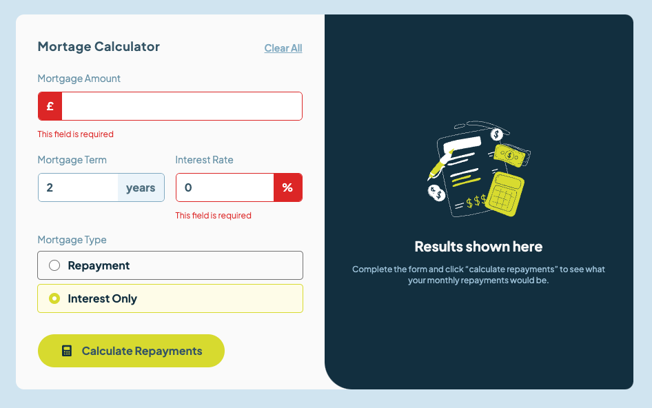
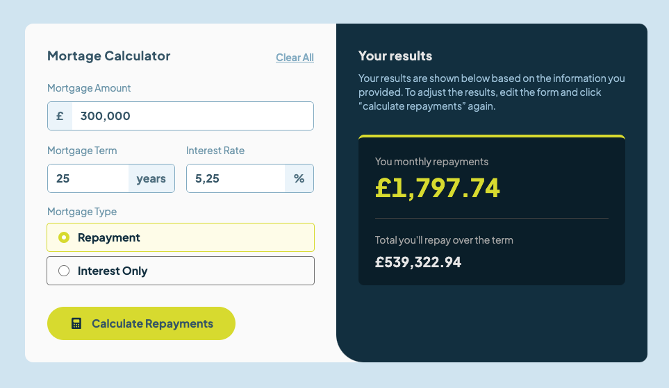
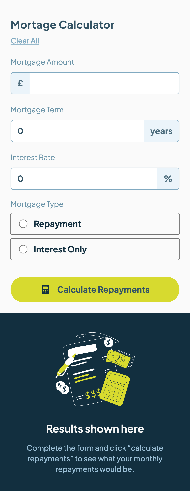
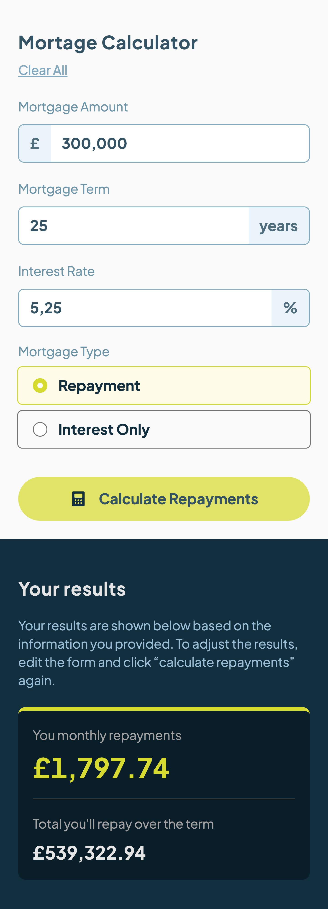

# Frontend Mentor - Mortgage repayment calculator solution

This is a solution to the [Mortgage repayment calculator challenge on Frontend Mentor](https://www.frontendmentor.io/challenges/mortgage-repayment-calculator-Galx1LXK73). Frontend Mentor challenges help you improve your coding skills by building realistic projects. 

## Table of contents

- [Overview](#overview)
  - [The challenge](#the-challenge)
  - [Screenshots](#screenshot)
  - [Links](#links)
- [My process](#my-process)
  - [Built with](#built-with)
  - [What I learned](#what-i-learned)
- [Author](#author)

**Note: Delete this note and update the table of contents based on what sections you keep.**

## Overview

### The challenge

Users should be able to:

- Input mortgage information and see monthly repayment and total repayment amounts after submitting the form
- See form validation messages if any field is incomplete
- Complete the form only using their keyboard
- View the optimal layout for the interface depending on their device's screen size
- See hover and focus states for all interactive elements on the page

### Screenshots

#### Desktop

#### Mobile

|  |  |
| ------------------------------------------------------------ | ------------------------------------------------------------ |

### Links

- Solution URL: [Add solution URL here](https://your-solution-url.com)
- Live Site URL: [Add live site URL here](https://your-live-site-url.com)

## My process

### Built with

- Semantic HTML5 markup
- Tailwind
- Vue 3 (composition API)
- Nuxt 3
- Prettier validation enforced

### What I learned

There isn't any native ways to format an `input` field of type `number`. 
In order to have a `,` separator between the thousands, one have to write some javascript code to format the `input` element and to format the value back to a `number` afterwards.

## Author

- Website - [frite.dev](https://frite.dev)
- Frontend Mentor - [@vdsbenoit](https://www.frontendmentor.io/profile/vdsbenoit)
- Linkedin - [@vdsbenoit](https://www.linkedin.com/in/vdsbenoit/)

